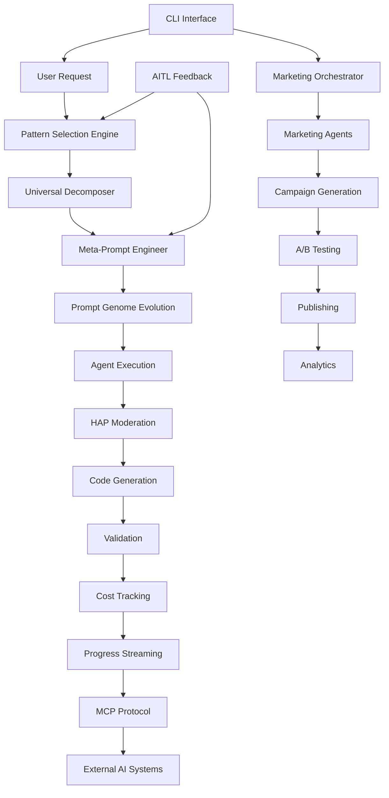

# Quantum Layer Platform - Advanced Features Guide

This document provides comprehensive documentation of the advanced AI and automation features that make the Quantum Layer Platform a revolutionary software development system.

## Table of Contents

1. [Meta-Prompt Engineering & Evolution System](#meta-prompt-engineering--evolution-system)
2. [Pattern Selection Engine](#pattern-selection-engine)
3. [Universal Decomposer](#universal-decomposer)
4. [Self-Improving Systems](#self-improving-systems)
5. [MCP (Model Context Protocol)](#mcp-model-context-protocol)
6. [Marketing Automation & Agents](#marketing-automation--agents)
7. [CLI (Command Line Interface)](#cli-command-line-interface)
8. [HAP System (Content Moderation)](#hap-system-content-moderation)
9. [Cost Tracking & Optimization](#cost-tracking--optimization)
10. [Progress Streaming & Real-time Updates](#progress-streaming--real-time-updates)

---

## Meta-Prompt Engineering & Evolution System

### Overview

The Meta-Prompt Engineering system implements evolutionary epistemology for prompt optimization, treating prompts as living organisms that can evolve, mutate, and improve over time.

### Components

#### 1. Prompt Genome (`src/agents/meta_prompts/prompt_genome.py`)

The Prompt Genome represents prompts as DNA-like structures that can evolve:

```python
class PromptGenome:
    """Evolutionary structure for prompts"""
    
    def __init__(self):
        self.dna = {
            "objectives": [],      # What the prompt aims to achieve
            "constraints": [],     # Limitations and boundaries
            "principles": [],      # Guiding principles from CS masters
            "patterns": [],        # Successful patterns discovered
            "meta_instructions": [] # Self-improvement directives
        }
        self.fitness_score = 0.0
        self.generation = 0
        self.mutations = []
```

**Key Features:**
- **Mutation Operations**: Add, remove, modify, crossover
- **Fitness Tracking**: Performance-based scoring
- **Evolution History**: Complete lineage tracking
- **Crossover Breeding**: Combine successful genomes

#### 2. Meta-Engineer (`src/agents/meta_prompts/meta_engineer.py`)

The Meta-Engineer implements recursive self-improvement:

**Evolution Strategies:**
- **Conjecture-Refutation**: Test hypotheses and refine
- **Explanation Depth**: Seek deeper understanding
- **Error Correction**: Learn from failures
- **Pattern Extraction**: Identify successful patterns

**Process Flow:**
1. Analyze task complexity and requirements
2. Select appropriate evolution strategy
3. Apply principles from the library
4. Generate improved prompts
5. Track performance for future evolution

#### 3. Principle Library (`src/agents/meta_prompts/principle_library.py`)

A curated collection of wisdom from computer science luminaries:

**Categories:**
- **Fundamental**: Core programming principles
- **Critical Rationalism**: Popper's philosophy applied to code
- **Architecture**: System design principles
- **Security**: Security-first thinking
- **Performance**: Optimization strategies

**Featured Thinkers:**
- **David Deutsch**: "Problems are inevitable, problems are soluble"
- **Karl Popper**: Critical rationalism and error correction
- **Edsger Dijkstra**: Simplicity and correctness
- **Donald Knuth**: Premature optimization insights
- **Fred Brooks**: No silver bullet, mythical man-month

### Usage Example

```python
# Meta-prompt evolution in action
genome = PromptGenome()
meta_engineer = MetaEngineer()

# Analyze task
task_analysis = meta_engineer.analyze_task(
    "Create a distributed cache system"
)

# Select principles
principles = principle_library.select_for_task(
    task_analysis.characteristics
)

# Evolve prompt
evolved_prompt = meta_engineer.evolve(
    genome,
    strategy="explanation_depth",
    principles=principles
)

# The system learns and improves with each generation
```

---

## Pattern Selection Engine

### Overview

The Pattern Selection Engine intelligently chooses from 8 advanced reasoning patterns based on task characteristics, optimizing for both quality and computational efficiency.

### The 8 Reasoning Patterns

#### 1. **Abstraction Pattern**
- **Use Case**: Complex system design, architecture
- **Approach**: Multi-level concept hierarchies
- **Example**: Designing microservice architectures

#### 2. **Emergent Pattern**
- **Use Case**: Pattern discovery, optimization problems
- **Approach**: Bottom-up emergence from data
- **Example**: Finding optimal algorithms from examples

#### 3. **Meta-Learning Pattern**
- **Use Case**: Strategy optimization, adaptive systems
- **Approach**: Learning how to learn better
- **Example**: Self-tuning performance optimizers

#### 4. **Uncertainty Pattern**
- **Use Case**: Ambiguous requirements, risk assessment
- **Approach**: Quantify and manage different uncertainties
- **Example**: Handling incomplete specifications

#### 5. **Constraint Pattern**
- **Use Case**: Resource-limited scenarios, optimization
- **Approach**: Constraint satisfaction and trade-offs
- **Example**: Memory-constrained embedded systems

#### 6. **Semantic Pattern**
- **Use Case**: Language understanding, API design
- **Approach**: Deep semantic relationship mapping
- **Example**: Natural language API generation

#### 7. **Dialectical Pattern**
- **Use Case**: Conflicting requirements, design decisions
- **Approach**: Synthesize opposing viewpoints
- **Example**: Security vs. usability trade-offs

#### 8. **Quantum Pattern**
- **Use Case**: Parallel exploration, complex analysis
- **Approach**: Superposition of multiple solutions
- **Example**: Exploring multiple architectures simultaneously

### Selection Algorithm

```python
def select_patterns(request_characteristics):
    """Intelligently select optimal patterns"""
    
    # Analyze request
    complexity = analyze_complexity(request)
    ambiguity = measure_ambiguity(request)
    constraints = extract_constraints(request)
    
    # Score each pattern
    pattern_scores = {}
    for pattern in ALL_PATTERNS:
        fitness = pattern.score_fitness(
            complexity, ambiguity, constraints
        )
        efficiency = pattern.computational_cost()
        pattern_scores[pattern] = fitness / efficiency
    
    # Select optimal subset within budget
    selected = optimize_selection(
        pattern_scores, 
        budget=3.0  # computational units
    )
    
    return selected
```

### Benefits

- **60-70% reduction** in computational overhead
- **50% faster** processing through targeted pattern use
- **Higher quality** task decomposition
- **Automatic optimization** - no manual pattern selection needed

---

## Universal Decomposer

### Overview

The Universal Decomposer breaks down complex requirements into atomic tasks without using templates or predefined structures, enabling true language and domain independence.

### Key Features

#### 1. **Emergent Understanding**
- No domain constraints
- No template dependencies
- Pure understanding from first principles

#### 2. **Pattern Learning**
```python
class UniversalDecomposer:
    def learn_from_success(self, decomposition, outcome):
        """Extract patterns from successful decompositions"""
        patterns = self.extract_patterns(decomposition)
        
        # Store in vector memory
        for pattern in patterns:
            self.memory_client.store_pattern(
                pattern,
                success_score=outcome.validation_score
            )
```

#### 3. **Abstract Pattern Extraction**
- **Complexity Signals**: Identifies task complexity indicators
- **Dependency Patterns**: Maps inter-task relationships
- **Execution Patterns**: Learns optimal execution order
- **Success Indicators**: Recognizes patterns of successful decompositions

### Decomposition Process

1. **Initial Analysis**: Understanding the core request
2. **Pattern Matching**: Find similar successful decompositions
3. **Task Generation**: Create atomic, executable tasks
4. **Dependency Mapping**: Establish task relationships
5. **Validation**: Ensure completeness and feasibility

---

## Self-Improving Systems

### AITL Feedback Loop

The AI-in-the-Loop (AITL) system creates a continuous learning cycle:

#### Components

1. **Pattern Analyzer**
   - Extracts patterns from AITL decisions
   - Categories: Security, Quality, Logic, Performance

2. **Learning Patterns**
   ```python
   learning_patterns = {
       "security": ["input validation", "auth checks", "encryption"],
       "quality": ["error handling", "logging", "documentation"],
       "logic": ["edge cases", "algorithm efficiency", "correctness"],
       "prompt_optimization": ["clarity", "specificity", "context"]
   }
   ```

3. **Agent Improvement**
   - Suggests prompt refinements
   - Updates tier selection logic
   - Optimizes resource allocation

4. **Performance Tracking**
   ```python
   def track_agent_performance(agent_tier, task_type, outcome):
       metrics = {
           "success_rate": outcome.success,
           "quality_score": outcome.quality,
           "execution_time": outcome.duration,
           "cost": outcome.token_usage
       }
       self.update_tier_performance(agent_tier, task_type, metrics)
   ```

### Adaptive Features

1. **Dynamic Resource Scaling**
   - Monitors CPU and memory usage
   - Adjusts batch sizes dynamically
   - Scales concurrent activities

2. **Adaptive Timeouts**
   - Calculates based on task complexity
   - Historical performance data
   - Safety margins for uncertainty

3. **Circuit Breakers**
   - Prevents cascading failures
   - Half-open state for recovery testing
   - Service-specific thresholds

---

## MCP (Model Context Protocol)

### Overview

MCP transforms QLP into an AI infrastructure service, allowing any AI system to access its capabilities through a standardized protocol.

### Architecture

#### 1. **MCP Server** (`src/mcp/mcp_server.py`)
- Implements MCP protocol specification
- Exposes tools and resources
- Manages sessions and context

#### 2. **Available Tools**

```python
tools = {
    "generate_code": {
        "description": "Generate production-ready code",
        "parameters": {
            "prompt": "string",
            "language": "string",
            "strategy": "ensemble|production|meta"
        }
    },
    "evolve_genome": {
        "description": "Evolve prompt genomes",
        "parameters": {
            "genome_id": "string",
            "performance_data": "object"
        }
    },
    "extract_patterns": {
        "description": "Extract design patterns from code",
        "parameters": {
            "code": "string",
            "language": "string"
        }
    },
    "search_memory": {
        "description": "Search vector memory",
        "parameters": {
            "query": "string",
            "type": "patterns|errors|solutions"
        }
    },
    "push_to_github": {
        "description": "Deploy to GitHub",
        "parameters": {
            "capsule_id": "string",
            "repo_name": "string",
            "private": "boolean"
        }
    }
}
```

#### 3. **Available Resources**

```
qlp://principles/software-engineering
qlp://genomes/active
qlp://metrics/performance
qlp://patterns/catalog
```

#### 4. **Context Management**

The MCP implementation maintains rich context:

```python
class MCPContext:
    def __init__(self):
        self.frames = []  # Context frames
        self.graph = {}   # Relationship graph
        self.active_genomes = {}
        self.learning_buffer = []
    
    def add_frame(self, frame_type, content):
        """Add context frame with relationships"""
        frame = ContextFrame(
            type=frame_type,
            content=content,
            timestamp=datetime.now(),
            relationships=self.extract_relationships(content)
        )
        self.frames.append(frame)
        self.update_graph(frame)
```

### Integration Example

```python
# External AI using QLP via MCP
client = MCPContextClient("http://localhost:8001/mcp")
await client.initialize()

# Set context
client.add_to_context("project", "e-commerce-platform")
client.add_to_context("requirements", {
    "features": ["product catalog", "cart", "checkout"],
    "tech_stack": ["Python", "FastAPI", "PostgreSQL"]
})

# Generate code with context
result = await client.generate_with_context(
    "Create the product catalog service"
)

# Search for patterns
patterns = await client.search_patterns(
    "e-commerce catalog", 
    limit=5
)

# Deploy to GitHub
github_result = await client.call_tool("push_to_github", {
    "capsule_id": result["capsule_id"],
    "repo_name": "my-catalog-service"
})
```

---

## Marketing Automation & Agents

### Overview

A complete AI-powered marketing department with 11+ specialized agents working together to create, optimize, and manage marketing campaigns.

### Agent Roster

#### 1. **Marketing Orchestrator**
- **Role**: Campaign CEO
- **Responsibilities**: Strategy, coordination, timeline management

#### 2. **Narrative Agent**
- **Role**: Brand storyteller
- **Output**: Campaign narratives, brand stories, messaging frameworks

#### 3. **Evangelism Agent**
- **Role**: Technical advocate
- **Output**: Developer-focused content, technical blogs, tutorials

#### 4. **Thread Builder Agent**
- **Role**: Social media expert
- **Output**: Viral Twitter threads, engaging social content

#### 5. **Persona Agent**
- **Role**: Audience specialist
- **Personas**: CTOs, Developers, Founders, Investors
- **Output**: Persona-specific content variants

#### 6. **Tone Agent**
- **Role**: Brand voice guardian
- **Tones**: Professional, Technical, Visionary, Casual
- **Output**: Tone-optimized content

#### 7. **A/B Testing Agent**
- **Role**: Experimentation scientist
- **Features**: Multivariate testing, statistical analysis
- **Output**: Test variants, winner selection

#### 8. **Engagement Monitor**
- **Role**: Analytics expert
- **Metrics**: Engagement, reach, conversions, ROI
- **Output**: Performance reports, insights

#### 9. **Scheduler Agent**
- **Role**: Timing optimizer
- **Features**: Timezone optimization, platform-specific timing
- **Output**: Content calendars, posting schedules

#### 10. **Iteration Agent**
- **Role**: Continuous improver
- **Process**: Learn from successes, refine strategies
- **Output**: Optimization recommendations

#### 11. **Feedback Summarizer**
- **Role**: Audience listener
- **Analysis**: Sentiment, reactions, trends
- **Output**: Actionable feedback summaries

### Campaign Workflow

```python
# 1. Campaign Creation
campaign = create_campaign(
    objective="launch_awareness",
    product="Quantum Layer Platform",
    audience=["developers", "CTOs", "tech leaders"],
    channels=["twitter", "linkedin", "medium", "email"],
    tone_preference="technical_visionary",
    duration="30_days"
)

# 2. Strategy Generation
strategy = marketing_orchestrator.generate_strategy(campaign)

# 3. Content Calendar
calendar = scheduler_agent.create_calendar(
    strategy,
    optimal_times_per_channel
)

# 4. Content Generation (Parallel)
tasks = [
    narrative_agent.create_story(strategy),
    thread_builder.create_threads(strategy, count=10),
    evangelism_agent.create_blogs(strategy, count=5),
    persona_agent.create_variants(content, personas)
]
content = await asyncio.gather(*tasks)

# 5. A/B Testing
test_variants = ab_testing_agent.create_variants(
    content,
    test_parameters=["headline", "cta", "tone"]
)

# 6. Publishing
publisher.schedule_content(calendar, content, test_variants)

# 7. Monitoring & Optimization
while campaign.active:
    metrics = engagement_monitor.track_performance()
    insights = feedback_summarizer.analyze_reactions()
    improvements = iteration_agent.suggest_improvements(
        metrics, insights
    )
    campaign.apply_improvements(improvements)
```

### Supported Channels

| Channel | Content Types | Features |
|---------|--------------|----------|
| Twitter/X | Threads, posts, replies | Hashtags, media, polls |
| LinkedIn | Posts, articles, updates | Professional tone, rich media |
| Medium | Long-form articles | Technical depth, code examples |
| Reddit | Posts, comments | Community-specific tone |
| Email | Campaigns, newsletters | Sequences, personalization |
| Dev.to | Technical tutorials | Code-heavy, practical |
| YouTube | Scripts, outlines | Video content planning |

### Analytics & Optimization

```python
class CampaignAnalytics:
    def __init__(self, campaign_id):
        self.metrics = {
            "reach": {
                "impressions": 0,
                "unique_views": 0,
                "share_reach": 0
            },
            "engagement": {
                "likes": 0,
                "shares": 0,
                "comments": 0,
                "clicks": 0
            },
            "conversion": {
                "signups": 0,
                "demo_requests": 0,
                "purchases": 0
            },
            "roi": {
                "cost": 0,
                "revenue": 0,
                "ltv": 0
            }
        }
    
    def calculate_performance(self):
        """Calculate key performance indicators"""
        return {
            "engagement_rate": self.engagement_rate(),
            "conversion_rate": self.conversion_rate(),
            "roi": self.return_on_investment(),
            "viral_coefficient": self.viral_coefficient()
        }
```

---

## CLI (Command Line Interface)

### Overview

The QuantumLayer CLI (`qlp`) provides a powerful, developer-friendly interface to all platform capabilities.

### Installation

```bash
# Via pip
pip install quantumlayer

# Development mode
cd qlp-cli && pip install -e .
```

### Core Commands

#### 1. **Generate Command**

```bash
# Basic generation
qlp generate "REST API for user management"

# With options
qlp generate "E-commerce platform" \
  --language python \
  --output ./my-project \
  --deploy aws \
  --github \
  --show-reasoning \
  --preview
```

**Options:**
- `--language, -l`: Specify language (auto-detects if not provided)
- `--output, -o`: Output directory
- `--deploy`: Deploy to cloud provider
- `--github`: Auto-create GitHub repository
- `--timeout, -t`: Generation timeout (minutes)
- `--dry-run`: Preview without generating
- `--show-reasoning, -r`: Display AI's thought process
- `--preview, -p`: Live code preview
- `--live, -L`: Show real-time activity tracking

#### 2. **Interactive Mode**

```bash
qlp interactive
```

Example session:
```
You: I need a real-time chat application
QL: What technology stack would you prefer?
You: Node.js with Socket.io
QL: Should I include user authentication?
You: Yes, with JWT
QL: Should I add file sharing capabilities?
You: Yes, for images and documents
QL: Type 'generate' when ready to build!
You: generate
[Generation begins with context from conversation]
```

#### 3. **From Image**

```bash
# Generate from architecture diagram
qlp from-image architecture.png --output ./backend

# Generate from UI mockup
qlp from-image mockup.png --type frontend --framework react
```

#### 4. **Watch Mode**

```bash
# Watch current directory
qlp watch

# Watch specific directory
qlp watch ./src --recursive
```

Watches for TODO comments:
```javascript
// TODO: QL: Implement user authentication with OAuth
// TODO: QL: Add rate limiting to this endpoint
```

#### 5. **Status Command**

```bash
# Check workflow status
qlp status workflow-abc-123

# Detailed status with activities
qlp status workflow-abc-123 --detailed
```

#### 6. **Statistics**

```bash
# Global platform statistics
qlp stats global

# Personal usage statistics
qlp stats personal

# Leaderboard
qlp stats leaderboard
```

### Configuration

```bash
# Initialize configuration
qlp config --init

# Set API endpoint
qlp config set api.url https://api.quantumlayerplatform.com

# Set API key
qlp config set api.key YOUR_API_KEY

# View configuration
qlp config list
```

### Environment Variables

```bash
export QLP_API_URL=http://localhost:8000
export QLP_API_KEY=your-api-key
export QLP_DEFAULT_LANGUAGE=python
export QLP_DEFAULT_OUTPUT=./generated
export QLP_GITHUB_TOKEN=ghp_...
```

### Advanced Features

#### 1. **Cost Tracking**

The CLI shows estimated and actual costs:
```
Estimated cost: $0.42
Actual cost: $0.38
Tokens used: 15,234
```

#### 2. **Progress Visualization**

```
Generating E-commerce Platform...
[■■■■■■□□□□] 60% - Creating product catalog service
├─ Analysis: ✓ Complete
├─ Design: ✓ Complete  
├─ Implementation: ● In progress
└─ Testing: ○ Pending
```

#### 3. **Export Options**

```bash
# Export as ZIP
qlp export capsule-123 --format zip

# Export to GitHub
qlp export capsule-123 --github my-repo

# Export with specific structure
qlp export capsule-123 --format zip --structure enterprise
```

### Marketing CLI

```bash
# Create campaign
qlp-marketing create \
  --objective launch_awareness \
  --channels twitter linkedin email \
  --audience developers \
  --duration 30d

# Generate content
qlp-marketing generate \
  --type tweet_thread \
  --topic "AI code generation" \
  --tone technical

# View analytics
qlp-marketing analytics campaign-123 \
  --metrics engagement conversion \
  --format charts

# Export campaign
qlp-marketing export campaign-123 \
  --format buffer  # or hootsuite, mailchimp
```

---

## HAP System (Content Moderation)

### Overview

The HAP (Hate, Abuse, Profanity) system provides intelligent content moderation with technical context awareness.

### Architecture

```python
class HAPService:
    """Multi-layer content moderation system"""
    
    def __init__(self):
        self.detectors = {
            "rule_based": RuleBasedDetector(),
            "ml_model": MLModelDetector(),
            "context_aware": ContextAwareDetector()
        }
        self.categories = [
            "hate_speech", "abuse", "profanity",
            "sexual", "violence", "self_harm", "spam"
        ]
        self.severity_levels = [
            "CLEAN", "LOW", "MEDIUM", "HIGH", "CRITICAL"
        ]
```

### Key Features

#### 1. **Technical Context Awareness**

Distinguishes technical terms from inappropriate content:
```python
# Examples of technical context
technical_terms = {
    "kill": ["kill process", "kill -9", "kill signal"],
    "abort": ["abort transaction", "abort mission"],
    "slave": ["master/slave", "slave node"],
    "execute": ["execute query", "execute command"]
}
```

#### 2. **Multi-Layer Detection**

1. **Rule-Based Layer**: Fast pattern matching
2. **ML Model Layer**: Transformer-based classification
3. **Context Layer**: Semantic understanding

#### 3. **Caching & Performance**

```python
@lru_cache(maxsize=10000)
def check_content_cached(content_hash):
    """Cache frequently checked content"""
    return self.check_content(content)
```

### Usage

```python
# Check content
result = hap_service.check_content(
    "This code will kill the process",
    context="technical"
)

# Result structure
{
    "severity": "CLEAN",
    "categories": [],
    "confidence": 0.95,
    "technical_context": True,
    "explanation": "Technical usage of 'kill' detected"
}
```

---

## Cost Tracking & Optimization

### Overview

Comprehensive cost tracking across all LLM providers with optimization strategies.

### Provider Support

```python
PROVIDER_COSTS = {
    "openai": {
        "gpt-4": {"input": 0.03, "output": 0.06},
        "gpt-3.5-turbo": {"input": 0.0005, "output": 0.0015}
    },
    "anthropic": {
        "claude-3-opus": {"input": 0.015, "output": 0.075},
        "claude-3-sonnet": {"input": 0.003, "output": 0.015}
    },
    "azure": {
        "gpt-4": {"input": 0.03, "output": 0.06},
        "gpt-35-turbo": {"input": 0.0005, "output": 0.0015}
    },
    "aws_bedrock": {
        "claude-3-opus": {"input": 0.015, "output": 0.075},
        "llama-3-70b": {"input": 0.00195, "output": 0.00256}
    }
}
```

### Cost Optimization Strategies

1. **Model Selection**
   ```python
   def select_optimal_model(task_complexity, budget):
       if task_complexity < 0.3 and budget < 1.0:
           return "gpt-3.5-turbo"  # Cheapest
       elif task_complexity < 0.7:
           return "claude-3-sonnet"  # Balanced
       else:
           return "gpt-4"  # Highest quality
   ```

2. **Token Optimization**
   - Compress prompts
   - Remove redundancy
   - Use references instead of repetition

3. **Caching Strategy**
   - Cache common patterns
   - Reuse similar completions
   - Vector similarity matching

---

## Progress Streaming & Real-time Updates

### Overview

Real-time progress updates using WebSockets and Server-Sent Events (SSE).

### Implementation

```python
class ProgressStreamer:
    def __init__(self):
        self.connections = {}  # Active connections
        self.event_history = []  # For late joiners
        
    async def stream_event(self, event):
        """Stream event to all connected clients"""
        event_data = {
            "type": event.type,
            "timestamp": event.timestamp,
            "data": event.data,
            "progress": event.progress_percentage
        }
        
        # WebSocket clients
        for ws in self.websocket_connections:
            await ws.send_json(event_data)
        
        # SSE clients
        for sse in self.sse_connections:
            await sse.send(
                f"data: {json.dumps(event_data)}\n\n"
            )
```

### Event Types

```python
EVENT_TYPES = {
    "workflow.started": "Workflow initiated",
    "workflow.task.started": "Task execution began",
    "workflow.task.progress": "Task progress update",
    "workflow.task.completed": "Task finished",
    "workflow.activity.started": "Activity execution began",
    "workflow.activity.heartbeat": "Activity still running",
    "workflow.completed": "Workflow finished",
    "generation.preview": "Code preview available"
}
```

### Client Integration

```javascript
// WebSocket connection
const ws = new WebSocket('ws://localhost:8000/ws');
ws.onmessage = (event) => {
    const data = JSON.parse(event.data);
    updateProgress(data.progress);
    displayActivity(data.type, data.data);
};

// Server-Sent Events
const sse = new EventSource('/sse/workflow/abc-123');
sse.onmessage = (event) => {
    const data = JSON.parse(event.data);
    updateUI(data);
};
```

---

## Integration Architecture

All these advanced features work together in a sophisticated ecosystem:



This creates a self-improving, continuously learning system that gets better with every use, while providing enterprise-grade capabilities for both code generation and marketing automation.